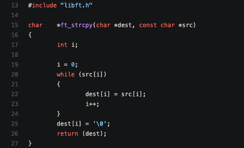

<!--
*** Thanks for checking out the Best-README-Template. If you have a suggestion
*** that would make this better, please fork the repo and create a pull request
*** or simply open an issue with the tag "enhancement".
*** Thanks again! Now go create something AMAZING! :D
***
***
***
*** To avoid retyping too much info. Do a search and replace for the following:
*** github_username, repo_name, twitter_handle, email, project_title, project_description
-->


<!-- PROJECT SHIELDS -->
<!--
*** I'm using markdown "reference style" links for readability.
*** Reference links are enclosed in brackets [ ] instead of parentheses ( ).
*** See the bottom of this document for the declaration of the reference variables
*** for contributors-url, forks-url, etc. This is an optional, concise syntax you may use.
*** https://www.markdownguide.org/basic-syntax/#reference-style-links
-->


<!-- PROJECT LOGO -->
<br />
<p align="center">
  <a href="https://github.com/MooseandSquvirrel/My_C_library">
    
  </a>

  <h3 align="center">My_C_Library</h3>

  <p align="center">
    Recoding part of the Standard C Library.
    <br />
    <a href="https://github.com/MooseandSquvirrel/My_C_library"><strong>Explore the docs »</strong></a>
    <br />
    <br />
    <a href="https://en.wikipedia.org/wiki/The_C_Programming_Language">C Language Wiki</a>
  </p>
</p>


<!-- TABLE OF CONTENTS -->
<details open="open">
  <summary><h2 style="display: inline-block">Table of Contents</h2></summary>
  <ol>
    <li>
      <a href="#about-the-project">About The Project</a>
      <ul>
        <li><a href="#built-with">Built With</a></li>
      </ul>
    </li>
    <li>
      <a href="#getting-started">Getting Started</a>
      <ul>
        <li><a href="#prerequisites">Prerequisites</a></li>
        <li><a href="#installation">Installation</a></li>
      </ul>
    </li>
    <li><a href="#usage">Usage</a></li>
    <li><a href="#license">License</a></li>
    <li><a href="#contact">Contact</a></li>
    <li><a href="#acknowledgements">Acknowledgements</a></li>
  </ol>
</details>


<!-- ABOUT THE PROJECT -->
## About The Project

<p align="center">
  <a href="https://github.com/MooseandSquvirrel/My_C_library">
    
  </a>
</p>

This project was part of an intensive education on learning the fundamentals of computer programming. 
The course focused on project-based learning that primarily focused on the basics 
of the C language. This particular project was to recode a portion of the standard C library's functions
including accounting for the faults that had to occur with each function. In other words, we could not 
fix some of the errors that certain functions don't account for in their original code. We had to reproduce
the exact same functionality as the original. We also were encouraged to create a few of our own functions.


### Built With

* [C](https://www.learn-c.org/)


<!-- GETTING STARTED -->
## Getting Started

To get a local copy up and running follow these simple steps.

### Prerequisites

* None, other than making sure your machine has GCC/GNU Unix capabilities for running the MakeFile.
  ```sh
  N/A
  ```

### Installation

1. Clone the repo.
   ```sh
   git clone https://github.com/MooseandSquvirrel/My_C_library.git
   ```


<!-- USAGE EXAMPLES -->
## Usage

You can use this library to build projects in C, and be able to modify the functions directly, or add new ones.

_For more examples, please refer to the [Documentation](https://github.com/MooseandSquvirrel/My_C_library.git)_


<!-- CONTACT -->
## Contact

Andy Gardner - web.dev.bud1@gmail.com

Project Link: [https://github.com/MooseandSquvirrel/My_C_library](https://github.com/MooseandSquvirrel/My_C_library)


